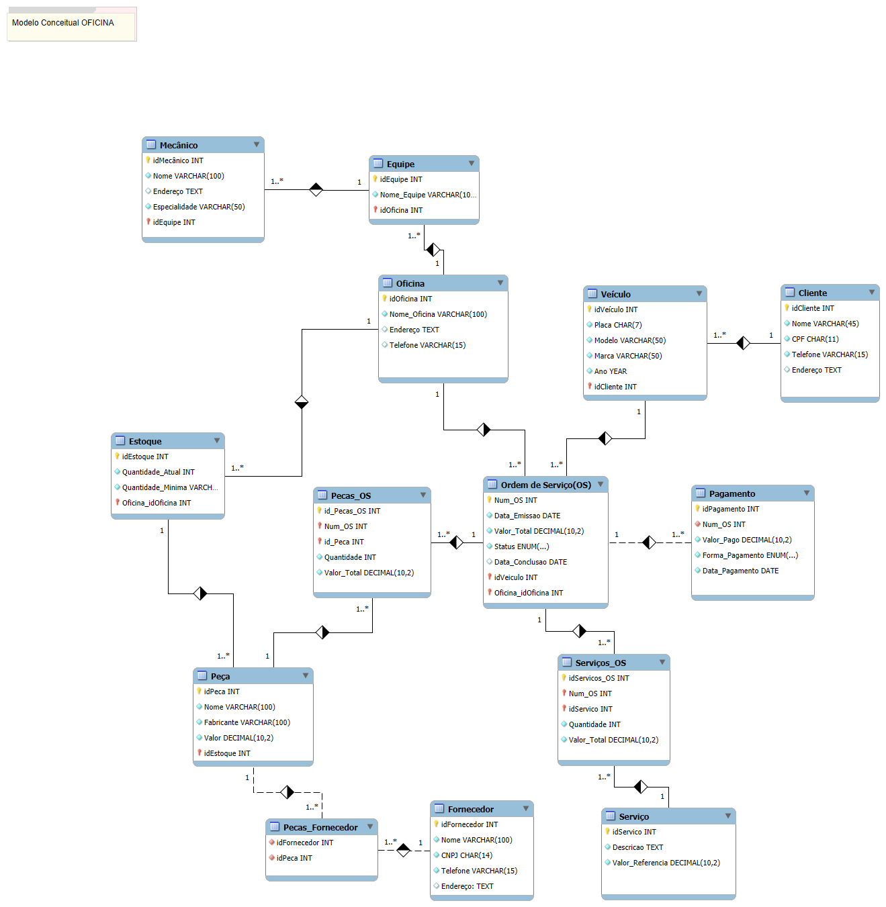

# Modelo EER para Sistema de Oficina

Este repositório contém um modelo de **Entidade-Relacionamento (EER)** para um sistema de oficina, desenvolvido no **MySQL Workbench**. O modelo foi projetado para gerenciar informações de clientes, veículos, ordens de serviço, mecânicos, serviços, peças e pagamentos, com foco na organização e controle de processos em uma oficina mecânica.

## Descrição

Este modelo de banco de dados foi criado para armazenar e organizar as principais informações de uma oficina de reparos, abrangendo desde o cadastro de clientes e veículos até o controle de serviços realizados, peças usadas e formas de pagamento. O diagrama foi elaborado no **MySQL Workbench** e inclui as seguintes entidades principais:

- **Cliente**: Contém informações sobre os clientes (pessoa física ou jurídica).
- **Veículo**: Registra os veículos dos clientes que são atendidos pela oficina.
- **Ordem de Serviço (OS)**: Acompanha o status e os detalhes dos serviços prestados aos veículos.
- **Equipe e Mecânico**: Organiza os mecânicos e suas respectivas especialidades.
- **Serviços**: Descreve os tipos de serviços realizados.
- **Peças**: Registra as peças utilizadas em cada ordem de serviço.
- **Estoque**: Controla as quantidades e o estoque das peças.
- **Oficina**: Representa a oficina onde os serviços são realizados.
- **Fornecedor**: Gerencia os fornecedores de peças utilizadas na oficina.
- **Pagamento**: Registra os pagamentos realizados para as ordens de serviço.

## Diagrama EER

O diagrama de Entidade-Relacionamento (EER) foi desenvolvido no **MySQL Workbench**. Abaixo está o diagrama do banco de dados, que ilustra como as entidades se relacionam:



## Como Usar

1. **Clone o repositório:**
   ```bash
   git clone https://github.com/jvskora/Modelo-EER-Conceitual-Oficina.git
2. **Abra o modelo no MySQL Workbench:**
    Abra o arquivo modelo_EER_oficina.mwb no MySQL Workbench para visualizar e manipular o modelo de banco de dados.
